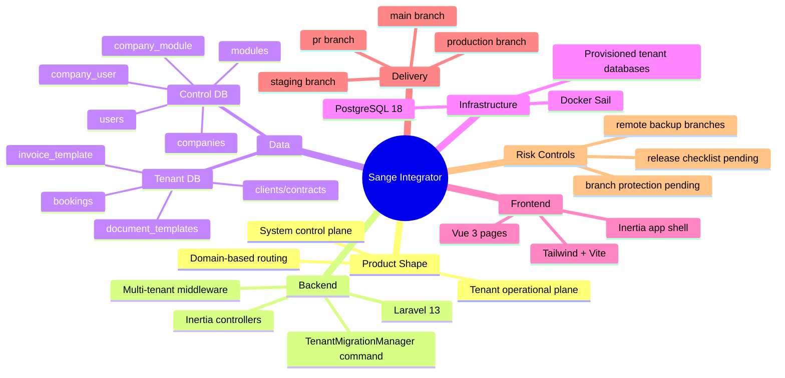

# Mind Map

```mermaid
mindmap
  root((Sange Integrator))
    Product Shape
      Domain-based routing
      System control plane
      Tenant operational plane
    Backend
      Laravel 13
      Inertia controllers
      Multi-tenant middleware
      TenantMigrationManager command
    Data
      Control DB
        users
        companies
        company_user
        modules
        company_module
      Tenant DB
        bookings
        clients/contracts
        document_templates
        invoice_template
    Infrastructure
      Docker Sail
      PostgreSQL 18
      Provisioned tenant databases
    Frontend
      Vue 3 pages
      Inertia app shell
      Tailwind + Vite
    Delivery
      pr branch
      staging branch
      production branch
      main branch
    Risk Controls
      remote backup branches
      branch protection pending
      release checklist pending
```
