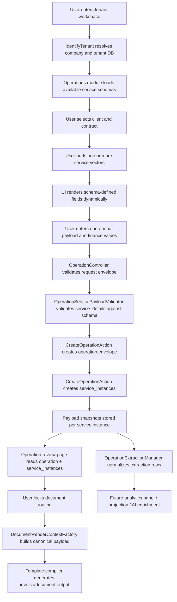

# Service Handling Flow

Last updated: 2026-05-15

This flow describes how a service vector is handled from capture to documents and downstream analytics.

## Runtime Flow

## Logical Stages

### 1. Tenant and handler context

The request must first resolve:

- active company
- active tenant database
- enabled module context
- current handler context

### 2. Dynamic capture

The UI does not hardcode passenger/patient/etc. models.
It renders fields from the selected service vector and stores them inside the service instance payload.

### 3. Commercial capture

At the same capture point, the operator supplies:

- qty
- supplier cost
- tax
- client price
- totals

This makes the operational record commercially meaningful immediately.

### 4. Runtime persistence

The system persists:

- one parent `operation`
- one or more child `service_instances`
- one snapshot per service instance

### 5. Document generation

Documents are built from canonical runtime roots, not from domain-specific child tables.

### 6. Downstream extraction

Analytics should consume normalized extraction rows from service instances, not query raw runtime payloads directly forever.

## Decision Boundary

The most important architectural rule in this flow is:

**capture dynamically first, project later**

That keeps the runtime flexible while preserving a path to reporting and AI-assisted analysis.
