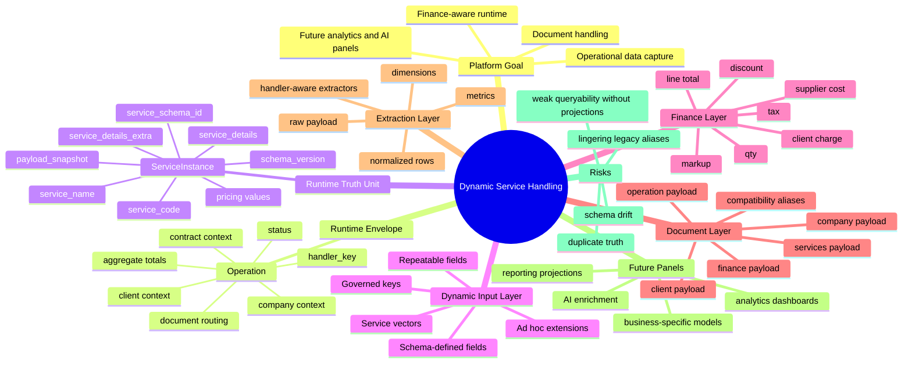

# Service Handling Mind Map

Last updated: 2026-05-15

This mind map shows the conceptual structure of how service handling fits into the operations platform.

```mermaid
mindmap
  root((Dynamic Service Handling))
    Platform Goal
      Operational data capture
      Document handling
      Finance-aware runtime
      Future analytics and AI panels
    Runtime Envelope
      Operation
        company context
        client context
        contract context
        status
        document routing
        aggregate totals
        handler_key
    Runtime Truth Unit
      ServiceInstance
        service_schema_id
        service_code
        schema_version
        service_name
        service_details
        service_details_extra
        pricing values
        payload_snapshot
    Dynamic Input Layer
      Service vectors
      Schema-defined fields
      Governed keys
      Repeatable fields
      Ad hoc extensions
    Finance Layer
      qty
      supplier cost
      tax
      discount
      markup
      client charge
      line total
    Document Layer
      operation payload
      services payload
      finance payload
      client payload
      company payload
      compatibility aliases
    Extraction Layer
      normalized rows
      dimensions
      metrics
      raw payload
      handler-aware extractors
    Future Panels
      analytics dashboards
      AI enrichment
      business-specific models
      reporting projections
    Risks
      duplicate truth
      schema drift
      lingering legacy aliases
      weak queryability without projections
```
